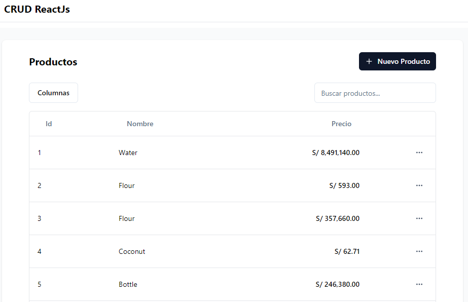
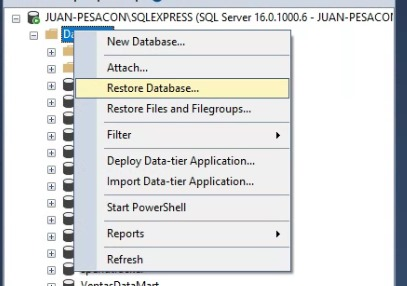
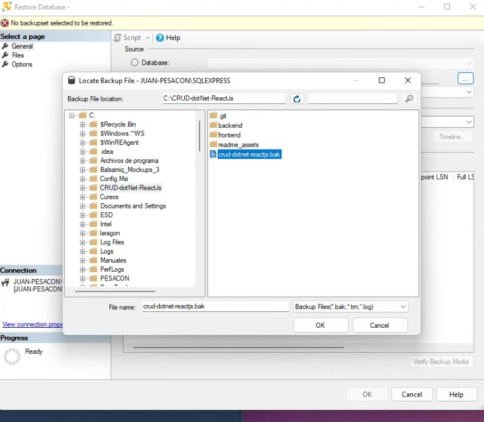
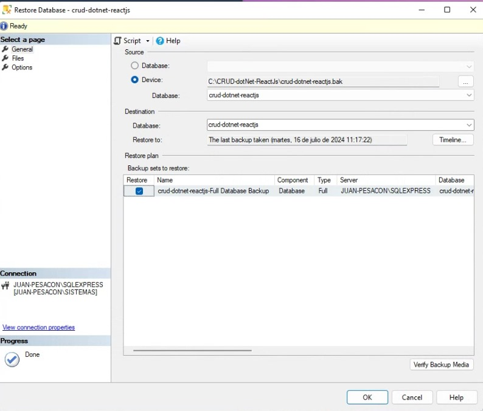
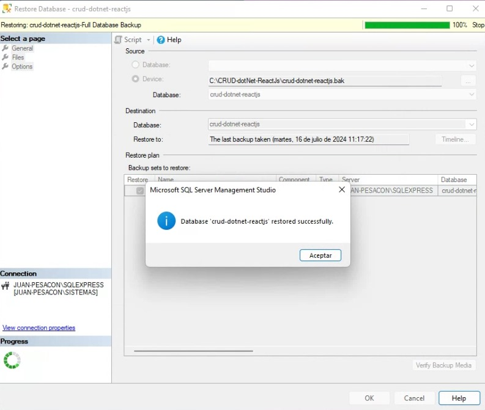
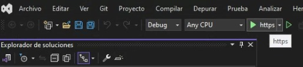

# CRUD .NET + ReactJs :rocket:


## Tabla de Contenidos
- [Acerca De](#acerca-de)
- [Tecnologías](#tecnologías)
- [Instalaciones Necesarias](#instalaciones-necesarias)
- [Ejecutar](#ejecutar)

## Acerca De
Aplicación web simple para gestionar una lista de productos. Permite realizar todos los elementos del **CRUD** (Listar, Obtener, Crear, Editar y Eliminar).



## Tecnologías
- Para el **backend** utiliza [.NET_8](https://dotnet.microsoft.com/es-es/)  con [EntityFramework](https://learn.microsoft.com/es-es/ef/) para gestionar la base de datos [SQL_Server](https://www.microsoft.com/es-es/sql-server/sql-server-2022). El proyecto está organizado en capas que permiten escalabilidad sin perjudicar el mantenimiento.

- Para el **frontend** utiliza [ReactJs_18](https://react.dev/)  con [Vite](https://vitejs.dev/) como servidor, [React_Router](https://reactrouter.com/en/main) como sistema de rútas y [shadcn/ui](https://ui.shadcn.com/) como libreria de componentes. De esta manera, se obtiene una aplicación rápida, eficiente y amigable para el usuario con un diseño moderno y minimalista.

## Instalaciones Necesarias
- [Visual Studio Community 2022 + .NET 8.0 Runtime](https://visualstudio.microsoft.com/es/vs/community/)

- [Sql Server 2022 Express + SSMS](https://www.microsoft.com/es-es/sql-server/sql-server-downloads)

- [Visual Studio Code (Recomendado)](https://code.visualstudio.com/download) 

- [NodeJs + Npm](https://nodejs.org/en)

## Ejecutar
### Backend
1. Restaurar la base de datos con SSMS





2. Abrir la solución del proyecto con Visual Studio 2022.

3. Modificar la cadena de conexión en el archivo `appsettings.Development.json` por nuestras creedenciales.

```diff
{
  "ConnectionStrings": {
+    "ReadWriteConnectionString": "Server=JUAN-PESACON\\SQLEXPRESS;Database=crud-dotnet-reactjs;User Id=sa;Password=P3s4c0n!;TrustServerCertificate=true"
  },
  "Logging": {
    "LogLevel": {
      "Default": "Information",
      "Microsoft.AspNetCore": "Warning"
    }
  }
}
```
4. Modificar la cadena de conexión en el archivo `Constants/SQLConstants.cs` por nuestras creedenciales.

```diff
namespace backend.Constants;

public static class SQLConstants
{
    public const string DefaultConnectionString =
+        "Server=JUAN-PESACON\\SQLEXPRESS;Database=crud-dotnet-reactjs;User Id=sa;Password=P3s4c0n!;TrustServerCertificate=true";

    public const string ReadWriteConnectionString = "ReadWriteConnectionString";
}
```
5. Ejecutar el proyecto en el modo https.


### Frontend
1. Abrir el proyecto con Visual Studio Code o nuestro editor de código preferido.

2. Restaurar los paquetes node con el comando:
 ```sh
npm install
```
3. Verificar que el archivo `src/const/api/index.ts` posea el puerto correcto donde se ejecuta el backend.

```diff
export const api_definition = (route: string) => {
+  return `https://localhost:7024/api/${route}`
}
```

4. Ejecutar el proyecto con el comando:
```sh
npm run dev
```
